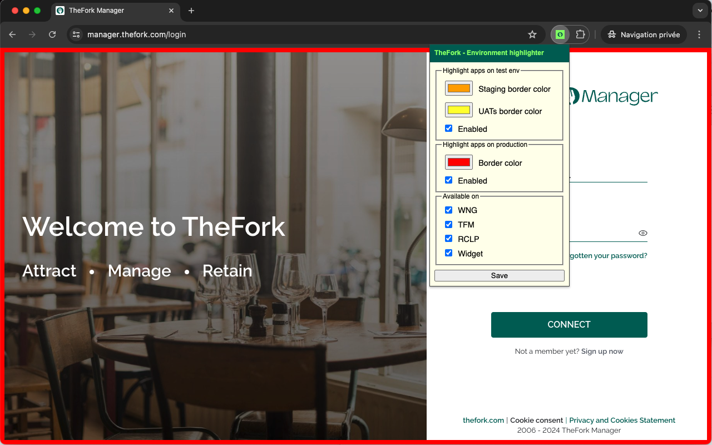

# TheFork - Environment highlighter

This Chrome extension allows you to add a visual overlay to common TheFork's frontends depending the environment you're currently browsing.

## Overview

Once this extension is installed, clicking the extension's action icon will open an extension pop-up with default settings provided.

You can save settings per environment (`UATs` and `staging` or `production`).

It's also possible to choose on which frontend you might want to enable the extension.

> :warning: When settings are updated, you need to refresh tabs to see the changes.

## Manual setup

Since the extension is not yet published to the Private Chrome Web Store. Follow these steps (from the official [documentation](https://cloud.google.com/blog/products/chrome-enterprise/publishing-extensions-for-the-enterprise?hl=en)) :
1. Signing into Chrome and browsing to chrome://extensions/  (Make sure you have developer mode on; it’s located at the top right) 
2. Clicking “load unpacked” and browse to your extension folder
3. Running the extension and ensuring that it functions correctly

## Implementation Notes

Please note this is the result of a 60 minutes side-project, it's not perfect ! Feel free to report any issue you might have or enhancements you would like to see.